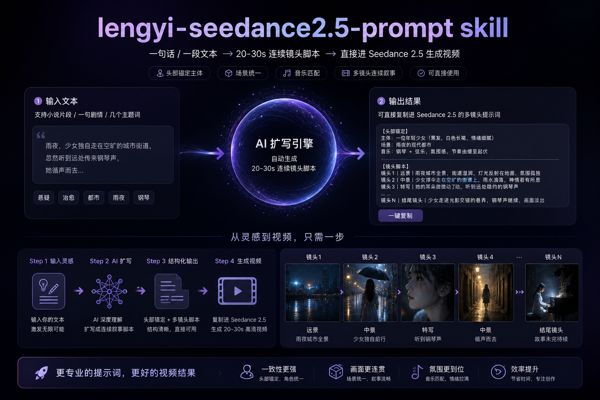

<div align="center">

# Seedance 2.5 提示词.skill

一款专为 **Seedance 2.5** 量身打造的视频提示词 Skill。<br>
**把一句想法/碎片主题/小说片段，变成一支高级的 30 秒电影。**

[](LICENSE)[](./SKILL.md)[](https://www.seedance.ai)[](./references/templates.md)

<p align="center">
  <a href="./README.md" style="display:inline-block;padding:6px 18px;background:#f3f4f6;color:#4b5563;border-radius:6px 0 0 6px;text-decoration:none;font-weight:600;">English</a> <a href="./README.zh.md" style="display:inline-block;padding:6px 18px;background:#4f46e5;color:#fff;border-radius:0 6px 6px 0;text-decoration:none;font-weight:600;">简体中文</a>
</p>

</div>

<p align="center">
  
</p>

---

## 🌟 为什么做这个 Skill？

写 AI 视频提示词，坑都在细节里。

死磕很久，才想明白这几件事：

**1**.Seedance对提示词不挑，但还是建议你写清楚**主体、场景、音乐和镜头**。
- **主体**：指明具体是哪张参考图，名字要贯穿始终；
- **场景**：上传一张场景图就够了；
- **音乐**：严格提示“不要生成任何BGM”，只生成音效，否则后期剪辑会非常痛苦；
- **镜头**：时间戳视内容情况而定，但镜号一定要写清楚，比如镜头01、02。

**2**.不用盲目追求分辨率。**720P对提示词遵循最好**，1080P次之，4K一般。

**3.核心依然是画面控制**。你的脑子里要有具体的分镜、画面、转场、动作、运镜和剧情等细节，有好的画面，才有好的故事。

**4**.如果你写的提示词，自己都不看，那也别指望Seedance能给你生成多么高质量的视频。

将这些认知固化成规则、模板、质检清单后，于是有了这个 Skill。**给它一段文本——小说片段、一句剧情、几个主题词——它给你一条可直接复制进 Seedance 2.5 的多镜头提示词，附带你需要的全部资产图的文生图提示词。** 

> 如果你被AI视频节奏、一致性、运镜折磨过——这个 Skill 是为你写的。

---

## ✨ 它能做什么

### 🎬 直出 Seedance 2.5 提示词

| 输入类型 | 处理方式 |
|---------|---------|
| 小说 / 剧本 / 脚本片段 | 提炼最具画面感的故事节奏，拆成连续镜头 |
| 一句简短剧情 | 补全前因后果与转折，再拆镜头 |
| 几个主题词 | 创意扩写出"起承转合"短片，再拆镜头 |

不管输入是什么，输出永远是同一种结构：**【脚本总览】+【资产图的文生图提示词】+【视频提示词】**，可以直接整块复制使用。

### 🎯 默认产出

- **总时长 20–30s**（上限 30s，超过自动收敛）
- **镜头数由故事节奏决定**，没有固定档位（30s 通常落在 8–14 镜）
- **每镜标注时间区间**，各镜时长之和严格等于总时长
- **附带你需要的全部资产图 T2I 提示词**：主体用干净背景、场景排除人物，用来在生成视频前先锁定一致性

### 📐 Skill工作流

1. **解析与扩写**：拆故事节奏、清点主体与场景、定基调
2. **定时长与镜头数**：按故事节拍排镜，每镜按类型给时长，加总校准
3. **建立主体与场景档案**：写锚点描述、取资产短名，锁定全片一致性
4. **写资产图 T2I 提示词**：主体 + 场景各给一条，先出图再出视频
5. **写多镜头视频提示词**：严格套统一模板，只写会动的画面
6. **控制总字数**：硬约束 ≤4000 字
7. **交付前质检**：11 项逐条核对，不过关不出门

---

## 🛠️ 设计哲学

这是 Skill 最有价值的部分，每条规则都是踩坑踩出来的。

### 1. 资产锚定：一致性的根本解法

维系一致性的本能反应是"每镜反复写主角外观"——这恰恰是错的：越复述，模型注意力越被占用，动作与运镜越弱。

**解法**：主体与场景的固定特征只在档案里写一次，作为资产图（T2I）的生成依据；视频提示词里只用**短名 + 本镜变化点**（如「武松」毡笠帽背系脊梁、发束被风吹乱），不复述"约30岁壮汉、浓眉方脸…"。一致性交给资产图去锁，提示词只负责"动"。

### 2. 按故事类型配置镜头

很多人先定"我要 12 镜"再用总时长÷12，结果通篇 2.5s 快切、毫无起伏——这就是狂切。

**硬规则**：镜头数是排完故事节拍、给每镜选好类型后算出来的结果，不是先定的指标。每镜时长按类型定：**特写/快切 2-3s、中景/叙事 3-6s、全景/建立 6-7s**。每次切镜必须有叙事理由（换空间/时间/视角/信息层级/情绪断点），能一镜说完的不切两镜，长短交替，快剪成组后用长镜收住。

典型 30s 骨架：`全景建立(6-7s) → 中景叙事×2-3 → 特写快剪组(2-3s)×3-4 → 中景过渡 → 全景收尾`

### 3. 纯写画面，不干扰模型

```
❌ 静帧式：武松站在山路上，夕阳余晖洒在身后，目光锐利
✅ 视频式：武松大步从画面深处走来，长袍下摆被风向后吹起，镜头从地面缓慢上摇至全景，夕阳从山脊缓缓下沉
```

镜头正文只写"摄影机拍到了什么、怎么动"——不写音效（交由头部固定音乐行）、不写 `剧情：…`、不写情绪解释，不去干扰模型。
**视频化三要素**（每镜自检，缺一重写）：① 强动词 ② 镜头运动词 ③ 环境/光线动态。

### 4. 统一提示词模板

```
主体：主体1、主体2
场景：场景名
音乐：不要生成任何背景音乐，只生成对应音效
镜头1 ｜ 0.0–6.0s ｜ …
镜头2 ｜ 6.0–9.5s ｜ …
```

- 音乐行固定不变（全片唯一声音指令，各镜不再描述音效）；风格关键词全片统一、只在镜头1点明一次。
- **硬约束**：各镜时长之和 = 总时长 ≤ 30s；输出总字数 ≤ 4000 字。超字数优先压重复环境/风格描述、合并次要镜头，**不靠删运镜省字**。

---

## 📁 项目结构

```
.
├── SKILL.md              # Skill 主文件（核心逻辑、工作流、硬约束）
├── references/
│   └── templates.md      # 输出模板 + 完整范例 + 镜头决策速查 + 风格/运镜/光线词库
├── public/
│   ├── 关于作者.md
│   ├── 公众号二维码.png
│   └── 海报.jpg
├── README.md             # English
└── README.zh.md          # 简体中文（本文件）
```

---

## 🚀 快速开始

### 这个 Skill 适用于谁

适用于任何支持 `Agent Skills` 规范的 AI Agent（如 Codex、Claude Code、WorkBuddy、TRAE Work、Qoder Work、Kimi Work 等）。只要你的 Agent 能读取并遵循 Skill 指令，就能用它来设计 Seedance 2.5 视频提示词。

理论上，推荐推理能力较强的模型，比如Claude Opus 5、K3、DeepSeek-v4-pro、Qwen3.8、GPT-5.6等。

### 安装

```bash
# 克隆仓库
git clone https://github.com/woyin2024/lengyi-seedance2.5-prompt.git
```

将整个 `lengyi-seedance2.5-prompt` 文件夹放入你 Agent 的 Skills 目录：

- **Claude Code 项目级**：`<项目>/.claude/skills/lengyi-seedance2.5-prompt/`
- **WorkBuddy 用户级**：`~/.workbuddy/skills/lengyi-seedance2.5-prompt/`
- **其他 Agent**：参照你所用工具的 Skill 安装说明

### 使用

安装后，在对话中用以下任意方式触发即可：

- "帮我把这段小说做成 Seedance 视频分镜"
- "用lengyi-seedance2.5-prompt ski，设计一个 30 秒的多镜头提示词，主题是……"
- "做个 shotlist，图生视频"

触发关键词：`seedance 视频提示词`、`多镜头提示词`、`视频分镜脚本`、`镜头脚本`、`shotlist`、`文生视频 / 图生视频`、`AI 视频镜头脚本`。

### 推荐工作流

```
1. 先用 Skill 生成「资产图 T2I 提示词」
2. 用 T2I 提示词在文生图模型里（比如Image2）生成主体 / 场景资产图
3. 把资产图 + Skill 输出的「视频提示词」一起喂给 Seedance 2.5
```

---

## 🖼️ 输出示例

输入一句剧情：**"武松在景阳冈醉酒后，遇见猛虎，赤手相搏。"**

输出（节选，完整版见 [`references/templates.md`](./references/templates.md)）：

```
【脚本总览】
· 总时长：30s　· 镜头数：9 镜　· 每镜均值：3.3s
· 镜头数理由：节拍是"登场—察觉—虎现—闪避—断棒—骑压—力竭—收尾"。
  开场用一个 6s 全景把荒山与醉汉一次交代清楚；中段两镜中景叙事；
  打斗是情绪爆点，用 3 个 2.5s 特写成组快剪；之后回到中近景与全景收住节奏。
· 节奏骨架：全景 6.0 → 中景 3 → 特写 2 → 中景跟拍 4.0 → 特写×3 → 中近景 3.0 → 全景 3.5
· 风格：电影感武侠，胶片颗粒，写实质感，暖黄夕照转冷月

【资产图文生图提示词】
- 主体「武松」：约30岁壮汉，浓眉方脸，黑须，发束高挽，土黄色粗布短打劲装，
  腰系深褐布带，背毡笠帽，手持哨棒，正面视角全身站姿，电影感武侠写实，胶片颗粒，
  干净白色背景只展示主体，8K，精致细节，studio 柔光
- 主体「猛虎」：成年华南虎，橙黄黑纹，体型壮硕，双目泛绿光，侧身蓄势姿态…
- 场景「景阳冈山道」：荒山土道，乱石枯草，两侧枯树斜出，黄昏残阳如血…

【视频提示词】
主体：武松、猛虎
场景：景阳冈山道
音乐：不要生成任何背景音乐，只生成对应音效
镜头1 ｜ 0.0–6.0s ｜ 景阳冈山道，电影感武侠，胶片颗粒，写实质感。大全景，
  低角度缓慢推近，至中段上摇越过乱石、末段停在人物中景。主体「武松」脚步踉跄、
  酒意上脸，由画面深处大步走来，哨棒拖地划出一道土痕，走到近处放慢、抬头四顾。
  长衫下摆被山风向后掀起，残阳从山脊持续下沉，影子被越拉越长。
镜头2 ｜ 6.0–9.5s ｜ 中景，镜头平稳跟拍武松右侧。武松抬起葫芦仰头饮酒、随手抹嘴…
  （后续镜头见完整范例）
```
---

## 🤝 参与贡献

这个 Skill 诞生于"自己用着不顺手"的反复打磨，但它一定还能更好。

如果你在使用中发现：

- 某类输入（广告片、动漫番剧、产品展示……）的镜头节奏还有优化空间
- 词库需要补充（新的运镜、光线、环境动态词汇）
- 模板在特定场景下可以更贴合 Seedance 2.5 的最新特性
- 想增加英文/双语输出的更多模式

都非常欢迎贡献：

1. Fork 本仓库
2. 创建特性分支：`git checkout -b feature/your-feature`
3. 提交更改：`git commit -m 'Add some feature'`
4. 推送分支：`git push origin feature/your-feature`
5. 提交 Pull Request

特别欢迎附带**真实跑通的案例**（输入 → 输出 → 模型生成效果）一起提过来，这比任何抽象讨论都有价值。

---

## 📜 开源协议

本项目基于 [MIT License](LICENSE) 开源。

个人学习用途，你可以自由使用、修改和分发；如需商用，请提前获得授权，微信联系lengcp2013。

---

## 👤 关于作者

**冷逸**，中国 Top AI 技术媒体「**沃垠AI**」博主，不会写代码的 Vibe Coding 开发者，喜欢死磕 Prompt、Skills 和 Agent。

- **全平台统一账户**：沃垠AI
- **标签**：产品、运营出身，AI 深度测评，超级 OPC
- **内容矩阵**：公众号、小红书、知乎、GitHub、B站、X 等

欢迎关注公众号「沃垠AI」，获取更多 AI 干货、Prompt 工程实战与 Skill 设计方法论：

<p align="center">
  
</p>

---

<div align="center">

### 如果它帮到了你，给个 ⭐ 吧

**感谢🙏**

</div>
